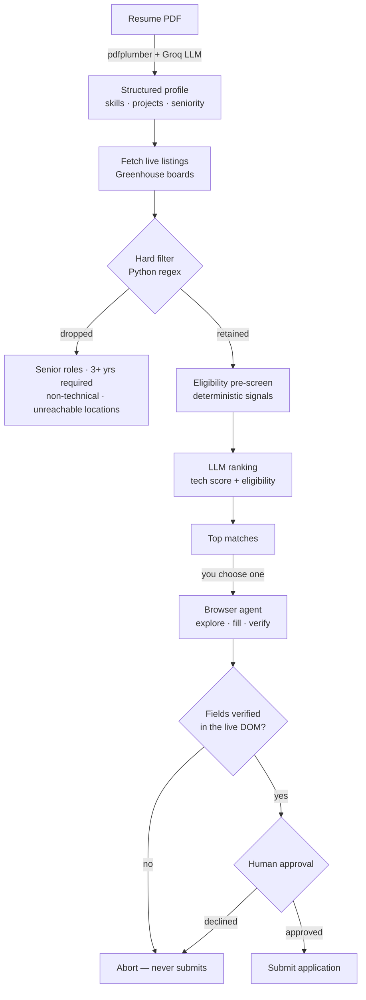

# ResumeAgent

**An AI agent that finds jobs you're actually eligible for — then fills out the application.**

Upload a resume PDF. An LLM extracts your profile, live company job boards are searched,
roles you can't realistically get are filtered out, the rest are ranked on skill fit *and*
eligibility separately, and a real browser fills the application form for you — with a
human approval gate before anything is ever submitted.

<!-- Add a screenshot or GIF here — it's the single highest-value addition to this README.
     Run the app, capture the ranked matches view, and drop it in as docs/screenshot.png:
      -->

---

## The problem

Job boards are full of listings you can't get.

Applying as a student from India, most postings are silently disqualifying — they want
3+ years of experience, they're senior roles, or they're on-site somewhere you have no
work authorization. None of that is in the job title. You find out after reading the
full description, which means most of the time spent job hunting is spent reading
listings that were never options.

Then, for the handful that do fit, you retype the same name, email, phone, and resume
into the same form, over and over.

ResumeAgent automates both halves: the filtering and the typing.

---

## How it works



### 1. Parse

`pdfplumber` extracts the text, then Groq (`openai/gpt-oss-120b`) returns a structured
profile: programming languages, frameworks, projects, education, years of experience,
and whether you're still a student. The prompt is explicit that missing information
stays `null` rather than being invented.

### 2. Discover

Pulls live postings from Greenhouse's public job board API for any companies you
configure. No scraping, no API key.

### 3. Rank

Two passes, and the order matters.

**A deterministic filter runs first.** Plain Python regex drops roles by title
(`senior`, `staff`, `manager`, plus non-engineering domains) and — more usefully — reads
the description body for experience requirements like "5+ years of professional
experience" and unreachable on-site locations. This is fast, free, and produces the same
answer every time. It also shrinks the candidate set before any tokens are spent.

**Then the LLM ranks what survived.** It receives the pre-computed eligibility signals as
constraints it is *not* permitted to override — a role the rules marked ineligible cannot
be talked back into eligibility by the model.

The output is deliberately **two scores, not one**:

| | |
|---|---|
| `tech_score` (0–100) | Skills, projects, education alignment. Ignores location and visa entirely. |
| `eligibility_status` | `Eligible` / `Requires Verification` / `Ineligible`, with a per-factor breakdown. |

Collapsing these into a single number hides *why* something ranked low. A perfect skill
match you legally can't accept isn't a 60% match — it's two separate facts, and you need
both to decide.

### 4. Apply

A real browser (via [WebCMD](https://www.npmjs.com/package/@agentrhq/webcmd), built on
Playwright) opens the Greenhouse form, maps its fields, fills your details, attaches the
PDF, and uses the LLM to answer custom questions from your resume.

Before submitting, it **reads every value back out of the live DOM** and aborts if the
name, email, or resume attachment didn't take. Then it stops and asks you.

---

## Safety model

Submitting a job application is irreversible, so the apply step is gated twice.

1. **Browser-state verification.** Filling a field and *confirming it holds the value*
   are different things — selectors drift, React inputs reject programmatic writes,
   uploads silently fail. The agent re-reads first name, last name, email, and the
   resume attachment from the live page. Any one missing aborts the run.

2. **Human approval.** The CLI prompts in the terminal; the API refuses unless the caller
   passes `approved: true`, which the web UI only sends after you confirm in a dialog.
   The agent never submits on its own initiative.

**On CAPTCHAs:** nearly every Greenhouse form embeds invisible, score-based reCAPTCHA —
a badge that asks the user for nothing. The agent only halts when a challenge is
*actually presented* (a visible challenge frame or a checkbox widget). It does not try
to solve or evade anything; a real challenge stops the run.

---

## Quick start

**Requirements:** Python 3.11+, Node.js 18+, a free [Groq API key](https://console.groq.com/),
and `webcmd` for the apply step (`npm install -g @agentrhq/webcmd`).

```bash
git clone https://github.com/Dakshhhhh-ops/resume-browser-agent.git
cd resume-browser-agent

# 1. Configure
cp .env.example .env          # add your GROQ_API_KEY

# 2. Python dependencies
python -m venv .venv
.venv/Scripts/pip install -r backend/requirements.txt   # Windows
# .venv/bin/pip install -r backend/requirements.txt     # macOS / Linux

# 3. Frontend dependencies
cd frontend && npm install && cd ..
```

Run the web app in two terminals:

```bash
python run_server.py          # API  → http://127.0.0.1:8010
cd frontend && npm run dev    # UI   → http://localhost:5173
```

Then walk the four phases: **Analyze Resume → Discover Jobs → Rank My Top Matches →
Apply with Agent**. Interactive API docs live at `/docs`.

### Or use the CLI

```bash
python main.py resume.pdf
```

Same pipeline, rendered as terminal panels, with the approval prompt inline.

### Verify the browser automation

```bash
python verify_webcmd.py                    # default posting
python verify_webcmd.py stripe 6201234     # any Greenhouse job
```

Opens a session, loads a real application form, and prints the fields it found. Nothing
is filled and nothing is submitted — it exists to prove the automation works without
touching a live application.

---

## Configuration

Everything lives in `.env` (see `.env.example`).

| Variable | Purpose |
| --- | --- |
| `GROQ_API_KEY` | **Required.** Used for parsing, ranking, and answering form questions. |
| `GROQ_MODEL` | Model id. Default `openai/gpt-oss-120b`. |
| `GREENHOUSE_COMPANY_SLUGS` | Comma-separated boards to search, e.g. `airbnb,stripe,figma`. |
| `APPLICANT_NAME` | Your **full** name. A single word leaves the required surname field as `"."`. |
| `APPLICANT_EMAIL` / `APPLICANT_PHONE` | Override the contact details parsed from the PDF. |
| `API_HOST` / `API_PORT` | Where the API binds. Defaults to `127.0.0.1:8010`. |
| `API_RELOAD` | Set to `1` for auto-reload during development. |
| `CORS_ORIGINS` | Origins allowed to call the API. Defaults cover Vite on 5173/5174. |
| `WEBCMD_PATH` | Explicit path to the `webcmd` binary, if it isn't on `PATH`. |

The frontend targets `http://127.0.0.1:8010` in development and its own origin in
production; `VITE_API_URL` overrides both.

---

## API

| Method | Route | Description |
| --- | --- | --- |
| `GET` | `/api/health` | Status, plus whether Groq is configured. |
| `POST` | `/api/resume/parse` | Multipart PDF upload → structured profile + display summary. Returns a `resume_path` the apply step reuses. |
| `GET` | `/api/jobs` | Fetch and flatten listings from the configured boards. |
| `POST` | `/api/jobs/rank` | `{resume, top_n}` → ranked matches with scores, breakdown, skills, and gaps. |
| `POST` | `/api/apply` | `{job, resume, resume_path, approved}` → runs the browser agent. |
| `GET` | `/api/applications` | Applications submitted so far. |

Ranking reuses the listings cached by the last `/api/jobs` call, so full job descriptions
never travel to the browser and back. On a cold server it fetches on demand.

---

## Deploying

The repo ships a single-service setup: FastAPI serves the API **and** the compiled React
app, so there's one URL and no CORS configuration.

On [Render](https://render.com): **New → Blueprint**, point it at this repo. It reads
`render.yaml`, builds the `Dockerfile`, and prompts for your secrets.

To check the image locally first:

```bash
docker build -t resume-job-agent .
docker run -p 8010:8010 --env-file .env resume-job-agent
```

The image is based on `mcr.microsoft.com/playwright` because the agent drives a real
Chromium — `webcmd` depends on `playwright-core`, which bundles no browser of its own.
Whenever `frontend/dist/` exists the server mounts it at `/`; otherwise `/` returns a
JSON status payload and you use the Vite dev server. The same code runs both ways.

---

## Project layout

```
backend/app/main.py   FastAPI application — all HTTP routes
run_server.py         API entrypoint
main.py               CLI entrypoint
resume_parser.py      PDF extraction + LLM profile parsing
job_search.py         Greenhouse board fetching
ranker.py             Hard filter, eligibility pre-screen, LLM ranking
browser_agent.py      Browser automation — explore, fill, verify, submit
workflow_store.py     Caches discovered form layouts per domain
verify_webcmd.py      Proves the automation works without submitting
frontend/             React + Vite web app
Dockerfile            Single-service production image
```

Runtime artifacts (`uploads/`, `applications_store.json`, `workflow_store.json`) are
generated on use and git-ignored.

---

## Limitations

Worth being straight about:

- **The final submit click is the least-tested path.** Every stage up to it is verified
  against live forms, but confirming submission end to end means sending a real
  application, so it hasn't been exercised in testing.
- **Applying is local-first.** It needs Chromium and 60–120s per run, so a free-tier
  512 MB host can't hold a browser. Datacenter IPs also score far worse against
  reCAPTCHA than a residential one. Parsing, discovery, and ranking deploy cleanly.
- **Uploads are ephemeral when deployed.** `uploads/` and `applications_store.json` sit
  on the container filesystem, which most PaaS hosts wipe on redeploy. Move them to
  object storage or a database to persist them.
- **Greenhouse only.** The form-filling selectors target Greenhouse's structure. Other
  ATS platforms (Lever, Workday, Ashby) would each need their own adapter.
- **LLM ranking isn't deterministic.** Temperature is 0, but scores can still shift
  between runs. The hard filter that precedes it *is* deterministic, which is much of
  why it exists.

---

## Tech stack

**Backend** — FastAPI, Groq (`openai/gpt-oss-120b`), pdfplumber, Greenhouse Job Board API
**Frontend** — React 19, Vite
**Automation** — WebCMD (Playwright), running a real Chromium
**Deploy** — Docker, Render

---

## License

MIT — see [LICENSE](LICENSE).
